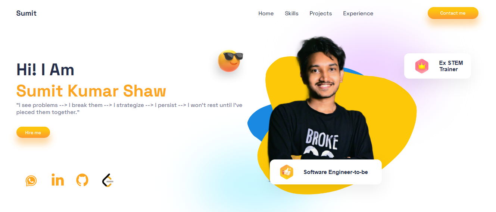

# **💼 Portfolio Project**

## **🔍 Overview**
This portfolio website showcases my skills, projects, and professional background. It highlights my expertise in web development and provides an interactive and responsive experience. Built using React, the site includes animations, smooth scrolling, and a contact form powered by EmailJS. This project demonstrates my proficiency in modern web technologies and design principles.

## **🌐 Live Project Link**
Check out the live project at [💼 Portfolio](https://sumitportfoliowebsite.netlify.app/)

## **💻 Technologies Used**
- **⚛️ React** (v18.3.1) – For building the user interface
- **🎞️ Framer Motion** – For animations and transitions
- **🖼️ Swiper** – For implementing carousels and sliders
- **✉️ EmailJS** – To handle contact form submissions
- **🔄 React Scroll** – For smooth scrolling between sections

## **📚 Key Learnings**
- Improved understanding of **⚛️ React component structure** and managing **📊 state**.
- Gained experience in creating **📱 responsive designs** using **🎨 CSS3** and **📏 media queries**.
- Leveraged **🎞️ Framer Motion** for interactive animations and learned best practices for creating fluid user experiences.
- Used **✉️ EmailJS** to integrate form submission without backend setup.
- Enhanced knowledge of working with third-party libraries like **🖼️ Swiper** and **🔄 React Scroll**.

## **✨ Key Features**
- **📱 Responsive Design**: Ensures that the portfolio looks great on devices of all sizes.
- **🎞️ Smooth Animations**: Added subtle animations for a polished user experience using **Framer Motion**.
- **🖼️ Interactive Elements**: Includes a carousel for showcasing projects with **Swiper**.
- **✉️ Contact Form**: Users can reach out via the form, which is powered by **EmailJS** for seamless submissions.
- **🔄 Smooth Scrolling**: Implemented smooth scroll behavior for a better user experience with **React Scroll**.

## **🚀 Additional Future Features**
- **🌙 Dark/Light Mode Toggle**: Implement a dark and light theme switch for enhanced user experience.
- **🛠️ Projects Filtering**: Add a feature to filter showcased projects by category or technology used.
- **📝 Blog Section**: Plan to introduce a blog section to share insights on web development and my learning journey.
- **💬 Testimonials Section**: Add a section for displaying client or colleague testimonials to build credibility.

## **📌 Conclusion**
This portfolio represents not only my technical skills but also my passion for web development and design. It serves as a living project that will continue to evolve as I learn new technologies and add new features. Through this project, I have gained valuable experience and further solidified my foundation in front-end development. I hope this portfolio provides insight into my capabilities and offers an enjoyable user experience for visitors.

## **📜 License**
This project is licensed under the **MIT License**.  
You are free to use, modify, and distribute this project as long as you include the original license.  
[Click here to view the full license text.](https://opensource.org/licenses/MIT)
